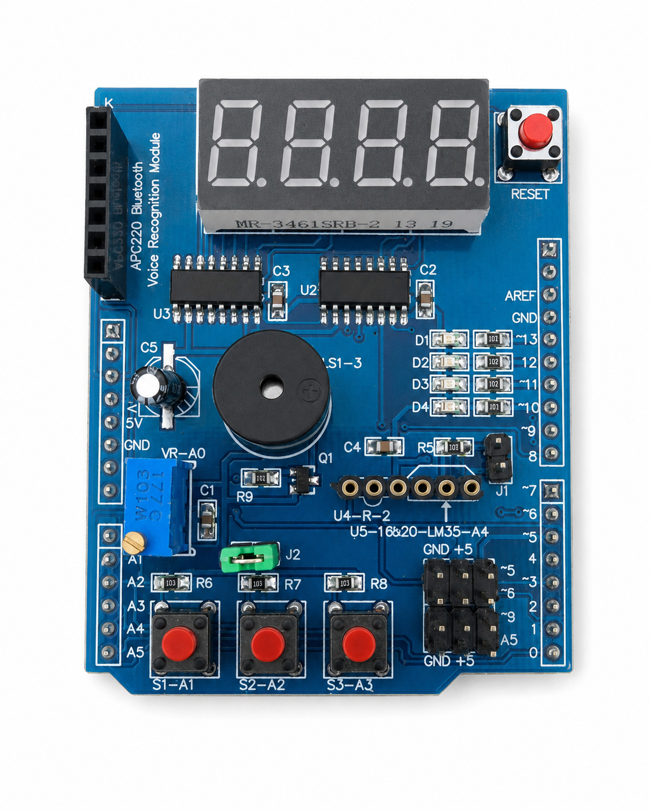
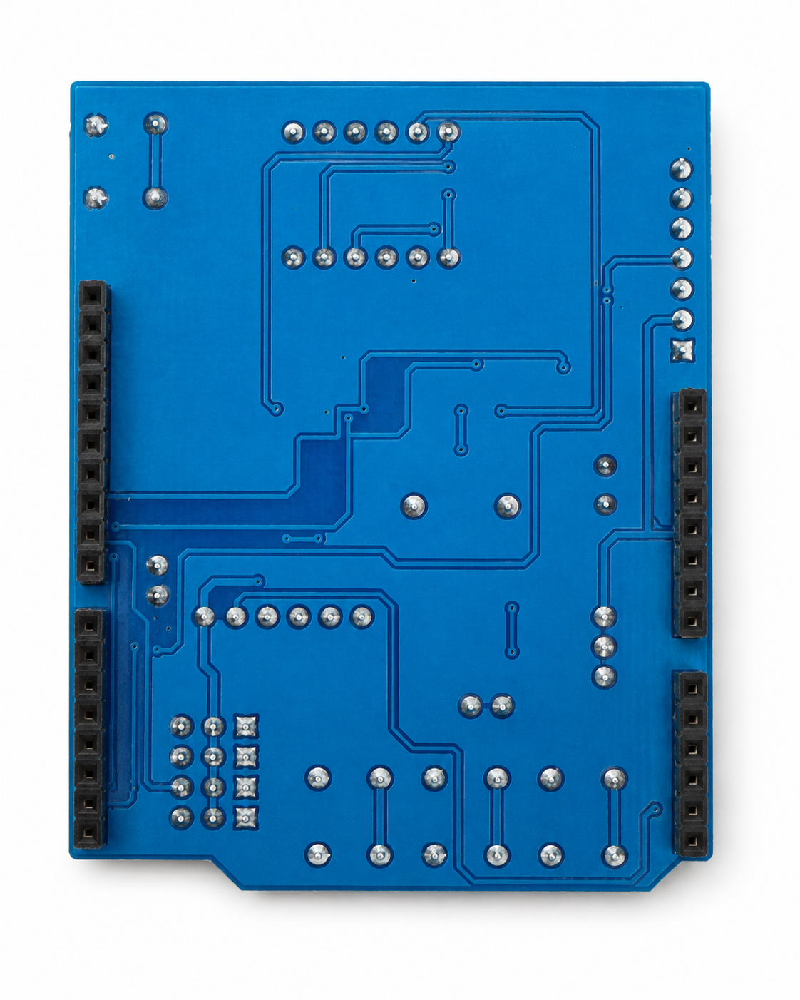

# Multi-Function Shield HW-262-compatible для Arduino UNO

**Статус:** `DRAFT / PINOUT-UNVERIFIED`  
**Экземпляр:** синяя плата с четырёхразрядным индикатором `MTR-3461SRB-2`, тремя кнопками `S1-S3`, четырьмя светодиодами `D1-D4`, зуммером, потенциометром и надписью `APC220 Bluetooth Voice Recognition Module`.

> [!WARNING]
> Внешне похожие платы могут иметь отличающуюся разводку. Приведённая карта контактов считается рабочей гипотезой до завершения стендовых тестов конкретного экземпляра.

## Связанные материалы

- [Обзорное видео: Arduino UNO и Multi-Function Shield](https://youtu.be/QEDrq-JDfx0)
- [Статья и обсуждение на KONTAKTS](http://kontakts.ru/showthread.php/40995)

## Фотографии экземпляра

<p align="center">
  <a href="photos/front.png">
    
  </a>
</p>
<p align="center"><em>Лицевая сторона платы. Нажмите на изображение, чтобы открыть оригинальный размер.</em></p>

<p align="center">
  <a href="photos/back.png">
    
  </a>
</p>
<p align="center"><em>Обратная сторона платы. Нажмите на изображение, чтобы открыть оригинальный размер.</em></p>

Исходные файлы документации: [`front.png`](photos/front.png) · [`back.png`](photos/back.png)

## 1. Назначение

Плата объединяет основные учебные узлы Arduino UNO:

- четыре светодиода;
- три пользовательские кнопки;
- четырёхразрядный семисегментный индикатор;
- пьезоизлучатель;
- аналоговый потенциометр;
- кнопку Reset;
- разъёмы для температурного датчика, сервоприводов и последовательных модулей.

Она подходит для лабораторных работ по цифровым входам и выходам, аналоговым измерениям, подавлению дребезга, генерации тона, сдвиговым регистрам и динамической индикации.

## 2. Идентифицированные элементы

| Узел | Наблюдаемая маркировка или исполнение | Статус |
|---|---|---|
| Индикатор | `MTR-3461SRB-2`, 4 разряда | визуально подтверждено |
| Светодиоды | D1-D4 | визуально подтверждено |
| Кнопки | S1-A1, S2-A2, S3-A3 | подтверждено шелкографией |
| Потенциометр | `VR-A0` | подтверждено шелкографией |
| Зуммер | `LS1-J` | визуально подтверждено |
| Температурный узел | `U5-18B20-LM35-A4` | подтверждено шелкографией, электрически не проверено |
| Сервовыводы | D5, D6, D9, GND, +5 V | подтверждено шелкографией |
| Микросхемы U2/U3 | вероятно 74HC595-совместимые | маркировка на фото читается недостаточно |

## 3. Предварительная карта контактов

| Функция | Предполагаемый вывод UNO | Предполагаемая логика | Проверка |
|---|---:|---|---|
| LED D1 | D13 | активный LOW | тест 01 |
| LED D2 | D12 | активный LOW | тест 01 |
| LED D3 | D11 | активный LOW | тест 01 |
| LED D4 | D10 | активный LOW | тест 01 |
| Кнопка S1 | A1 | активный LOW | тест 02 |
| Кнопка S2 | A2 | активный LOW | тест 02 |
| Кнопка S3 | A3 | активный LOW | тест 02 |
| Потенциометр | A0 | диапазон ADC 0-1023 | будущий тест 04 |
| Зуммер | D3 | `tone()` | тест 03 |
| Display LATCH | D4 | цифровой выход | будущий тест 05 |
| Display CLOCK | D7 | цифровой выход | будущий тест 05 |
| Display DATA | D8 | цифровой выход | будущий тест 05 |
| LM35 / DS18B20 | A4 | зависит от установленного датчика | будущий тест |
| Servo | D5, D6, D9 | управляющий импульс | будущий тест |

## 4. Конфликты выводов

- D3 используется зуммером;
- D4, D7 и D8 предположительно заняты индикатором;
- D10-D13 заняты светодиодами и пересекаются со SPI;
- A0 занят потенциометром;
- A1-A3 заняты кнопками;
- A4 используется температурным узлом и одновременно является SDA шины I2C на UNO.

## 5. Безопасное первое включение

1. Устанавливать шилд только на обесточенную Arduino UNO.
2. Проверить отсутствие смещения разъёмов на один контакт.
3. Первое включение выполнять без сервоприводов и внешних модулей.
4. После подачи USB-питания проверить отсутствие нагрева и запаха.
5. Запускать тесты последовательно: 01, 02, 03.
6. При неожиданном поведении сразу отключить питание и записать наблюдение.

## 6. Порядок стендовой проверки

### Тест 01 — четыре светодиода

Скетч: [`examples/01-leds/01-leds.ino`](examples/01-leds/01-leds.ino)

Ожидается последовательное включение D1, D2, D3, D4, затем одновременное мигание всех четырёх светодиодов.

Записать на видео:

1. общий вид Arduino UNO с установленным шилдом;
2. момент включения питания;
3. последовательность D1 → D2 → D3 → D4;
4. одновременное мигание;
5. сообщить, соответствует ли порядок надписям на плате.

### Тест 02 — кнопки S1-S3

Скетч: [`examples/02-buttons/02-buttons.ino`](examples/02-buttons/02-buttons.ino)

Открыть Serial Monitor на 115200 бод. Нажать по очереди S1, S2 и S3. Скетч сообщает изменение состояния и одновременно включает соответствующий светодиод.

Записать на видео экран Serial Monitor и саму плату. Каждую кнопку нажать два раза по отдельности, затем нажать две кнопки одновременно.

### Тест 03 — зуммер

Скетч: [`examples/03-buzzer/03-buzzer.ino`](examples/03-buzzer/03-buzzer.ino)

Ожидаются три тона различной частоты и короткая пауза между циклами. На видео должен быть слышен звук. Сообщить, нет ли постоянного писка до запуска скетча и различаются ли три тона.

## 7. Как оформить видеоотчёт

Название или подпись:

```text
Multi-Function Shield — тест 01 светодиоды
Multi-Function Shield — тест 02 кнопки
Multi-Function Shield — тест 03 зуммер
```

Для каждого теста сообщить:

- модель Arduino UNO;
- питание от USB или отдельного источника;
- результат `PASS`, `PARTIAL` или `FAIL`;
- фактический порядок элементов;
- замеченные отклонения.

## 8. Что ещё не проверено

- точная маркировка U2 и U3;
- распиновка и тип общего вывода индикатора;
- потенциометр A0;
- LM35 и DS18B20;
- сервовыходы D5, D6, D9;
- разъём APC220/Bluetooth;
- электрическая схема перемычек J1 и J2.

После получения видео тестов 01-03 документ будет обновлён фактическими результатами. Статус `BENCH-TESTED` присваивается только после успешной проверки всех основных узлов.
