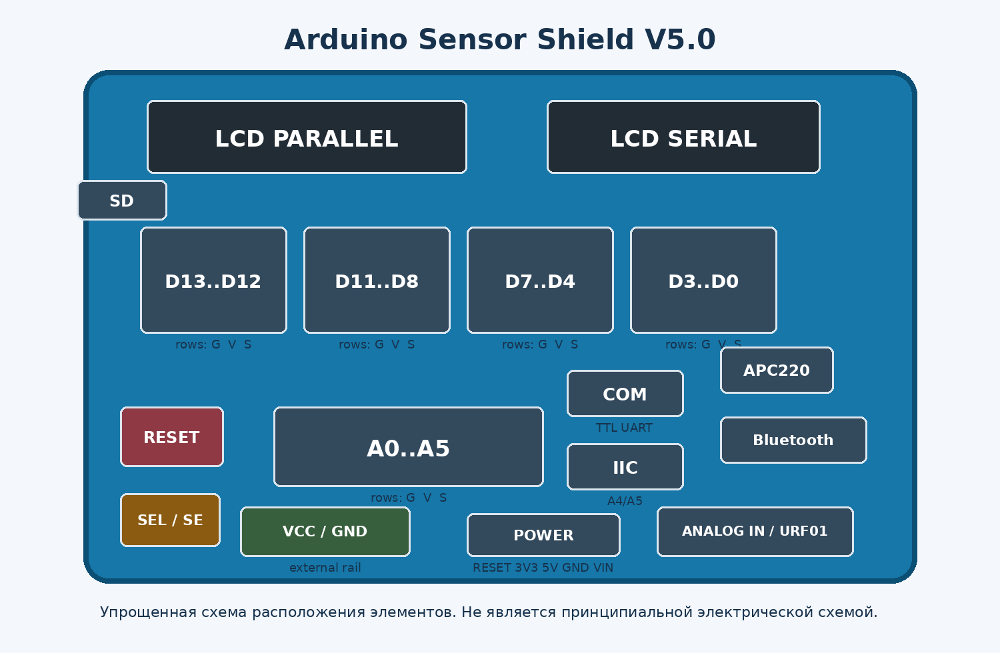

# Arduino Sensor Shield V5.0 для Arduino UNO R3

**Статус документа:** `DRAFT / HARDWARE-IDENTIFIED`  
**Область применения:** распространенная синяя плата Sensor Shield V5.0 с разъемами LCD Parallel, LCD Serial, COM, IIC, APC220, Bluetooth, SD и URF01.

> [!WARNING]
> Платы с одинаковой надписью `Sensor Shield V5.0` выпускаются разными производителями. Внешне совпадающая плата не гарантирует полностью одинаковую силовую разводку. Перед подачей внешнего питания обязательно проверьте конкретный экземпляр мультиметром.



## 1. Назначение

Sensor Shield V5.0 - это плата-разветвитель для Arduino UNO R3. Она не добавляет новые GPIO и не заменяет драйверы нагрузки. Ее задача - вывести контакты Arduino в удобные трехконтактные группы `G-V-S`, а также продублировать распространенные интерфейсы на отдельных разъемах.

Типовая трехконтактная группа:

```text
G - Ground, общий провод
V - линия питания модуля
S - сигнальный контакт Arduino
```

Shield удобен для учебных стендов, быстрого подключения датчиков, сервоприводов, кнопок, реле с логическим входом и небольших модулей без макетной платы.

## 2. Основные возможности

- цифровые выводы UNO выведены группами `G-V-S`;
- аналоговые входы A0-A5 выведены группами `G-V-S`;
- отдельные разъемы для UART/COM, I2C/IIC и SPI/SD;
- разъемы APC220, Bluetooth, URF01 и LCD;
- кнопка Reset;
- индикатор питания и индикатор D13;
- винтовая клемма внешней линии питания;
- перемычка `SEL` или `SE`, управляющая соединением групп питания.

## 3. Что означает маркировка G-V-S

| Контакт | Назначение | Практическое правило |
|---|---|---|
| `G` | общий провод, GND | земля датчика и Arduino должна быть общей |
| `V` | питание модуля | напряжение зависит от положения `SEL/SE` и конкретной разводки |
| `S` | сигнал | соединен с соответствующим Dn или An Arduino |

Перед установкой трехконтактного штекера проверьте порядок проводов. У сервоприводов обычно черный/коричневый провод - GND, красный - питание, желтый/оранжевый - сигнал, но ориентироваться следует по надписям `G`, `V`, `S` на плате.

## 4. Выводы Arduino UNO

### 4.1 Цифровые D0-D13

Цифровые выводы остаются теми же выводами UNO. Shield только дублирует их на удобных колодках.

Особые случаи:

- `D0/RX` и `D1/TX` используются аппаратным UART и USB Serial;
- `D10-D13` обычно задействованы при работе SPI;
- `D13` также связан со встроенным светодиодом UNO и индикатором на shield;
- использование специального разъема не освобождает соответствующий GPIO: электрически это тот же вывод.

### 4.2 Аналоговые A0-A5

A0-A5 используются как аналоговые входы либо как цифровые выводы. На UNO R3:

- `A4` - SDA шины I2C;
- `A5` - SCL шины I2C.

Разъем `IIC` является удобным повторным выводом этой шины, а не дополнительным независимым I2C-контроллером.

## 5. Специальные разъемы

| Маркировка | Назначение | Важное ограничение |
|---|---|---|
| `COM` | TTL UART, обычно D0/D1 | это не классический RS-232 с уровнями +/-12 В |
| `IIC` | I2C: SDA/SCL, питание, земля | на UNO R3 использует A4/A5 |
| `SD` | выводы для SPI-подключения SD-модуля | занимает соответствующие SPI/GPIO выводы |
| `APC220` | колодка для радиомодуля APC220 | проверить порядок контактов по шелкографии |
| `Bluetooth` | колодка для последовательного Bluetooth-модуля | распиновка не обязана совпадать со всеми HC-05/HC-06 |
| `LCD Parallel` | параллельный интерфейс дисплея | использует несколько цифровых выводов |
| `LCD Serial` | разъем для совместимого последовательного LCD | точная распиновка зависит от версии платы/дисплея |
| `URF01` | колодка для совместимого ультразвукового модуля | не универсальный стандарт для всех HC-SR04 |

Точная карта специализированных разъемов должна быть подтверждена схемой конкретного производителя или прозвонкой. Не подключайте модуль только по совпадению названия разъема.

## 6. Питание и перемычка SEL/SE

Официальная документация Keyestudio KS0004 описывает три группы питания как `V`, `V1` и `+`. Для этой версии указаны следующие режимы:

| Перемычка SE | Внешнее питание на клемме | Линия `V` | Линии `V1` и `+` |
|---|---:|---:|---:|
| установлена | нет | 5 В от UNO | 5 В от UNO |
| установлена | есть | внешнее напряжение | внешнее напряжение |
| снята | есть | внешнее напряжение | 0 В |
| снята | нет | 0 В | 5 В от UNO |

> [!CAUTION]
> В документации производителя встречается пример с 7 В на клемме. Это не означает, что 7 В безопасны для обычных датчиков и сервоприводов. При установленной перемычке внешнее напряжение может попасть непосредственно на группы питания модулей. Для стандартных 5-вольтовых устройств применяйте стабилизированный источник 5 В и сначала подтвердите разводку мультиметром.

### 6.1 Рекомендуемый режим для сервоприводов

1. Полностью отключить Arduino и USB.
2. Снять `SEL/SE`.
3. Прозвонить связь клеммы VCC с контактами `V` цифровых групп.
4. Подключить стабилизированный источник обычно 5-6 В, допустимый для конкретных сервоприводов.
5. Объединить GND внешнего источника и GND Arduino.
6. Только после проверки подключать сервоприводы.

Shield не является усилителем тока. Несколько сервоприводов нельзя надежно питать от 5V Arduino/USB: пусковые токи могут вызвать перезапуск платы, дрожание приводов и перегрев цепей питания.

## 7. Проверка конкретной платы мультиметром

Проверку выполнять без установленной Arduino и без подключенных модулей.

### 7.1 Проверка земли

- клемма `GND` должна звониться с контактами `G`;
- после установки на UNO земля shield должна быть общей с GND Arduino.

### 7.2 Проверка SEL/SE

Проверьте в обоих положениях перемычки:

- связь клеммы `VCC` с контактами `V` цифровых колодок;
- связь контактов `V` с выводом `5V` Arduino;
- связь питания аналоговых колодок и специальных разъемов с `5V` Arduino;
- отсутствие короткого замыкания между `VCC` и `GND`.

Результат лучше занести в таблицу измерений и дополнить фотографиями обеих сторон платы.

## 8. Безопасное первое включение

1. Осмотреть пайку и направление штыревых разъемов.
2. Установить `SEL/SE` в исходное положение только после прозвонки.
3. Не подключать внешнее питание одновременно с USB, пока не ясна схема питания конкретной платы.
4. Установить shield на обесточенную UNO без смещения контактов.
5. Первое включение выполнить без датчиков и сервоприводов.
6. Проверить индикатор питания и отсутствие нагрева.
7. Измерить напряжение между `V` и `G` на нескольких колодках.
8. Подключать модули по одному.

## 9. Примеры подключения

### Цифровой датчик к D2

```text
Sensor GND -> G рядом с D2
Sensor VCC -> V рядом с D2
Sensor OUT -> S рядом с D2
```

### Аналоговый датчик к A0

```text
Sensor GND -> G рядом с A0
Sensor VCC -> V рядом с A0
Sensor OUT -> S рядом с A0
```

### I2C-модуль

```text
GND -> GND
VCC -> питание, допустимое для модуля
SDA -> SDA / A4
SCL -> SCL / A5
```

### Сервопривод с внешним питанием

```text
Servo signal -> S выбранного цифрового вывода
Servo +      -> внешняя линия V
Servo GND    -> общая GND shield и внешнего источника
```

## 10. Ограничения платы

Sensor Shield V5.0:

- не добавляет новые GPIO;
- не повышает допустимый ток выводов ATmega328P;
- не содержит драйвера двигателей;
- не обеспечивает гальваническую развязку;
- не является преобразователем логических уровней 5 В / 3,3 В;
- не гарантирует защиту от переполюсовки и перенапряжения;
- не превращает TTL UART в настоящий RS-232;
- дублирует одни и те же выводы в нескольких разъемах, поэтому возможны конфликты функций.

## 11. План стендовой паспортизации KONTAKTS

Для перевода материала из `DRAFT` в `BENCH-TESTED` рекомендуется выполнить:

- фото лицевой и обратной стороны конкретной платы;
- маркировку производителя и версии PCB;
- карту прозвонки `SEL/SE`;
- измерение напряжений на `V`, `V1`, `+` в четырех режимах питания;
- проверку D0-D13 и A0-A5;
- определение распиновки COM, IIC, SD, APC220, Bluetooth, LCD и URF01;
- тест одного цифрового и одного аналогового датчика;
- тест сервопривода от отдельного источника;
- публикацию таблицы измерений и замечаний.

## 12. Источники

1. Keyestudio, **KS0004 Sensor Shield V5**: https://docs.keyestudio.com/projects/KS0004/en/latest/docs/KS0004%20keyestudio%20Sensor%20Shield%20V5.html
2. Keyestudio Wiki, **Ks0004 keyestudio Sensor Shield V5**: https://wiki.keyestudio.com/Ks0004_keyestudio_Sensor_Shield_V5
3. Arduino, **UNO R3 documentation**: https://docs.arduino.cc/hardware/uno-rev3/
4. Arduino, **Wire / I2C pin mapping**: https://docs.arduino.cc/language-reference/en/functions/communication/wire/

## Примечание о вариантах платы

Этот документ описывает распространенную синюю Sensor Shield V5.0, визуально совпадающую с платой пользователя. Полное электрическое соответствие конкретного экземпляра пока не подтверждено фотографией обратной стороны и прозвонкой, поэтому силовые соединения следует считать предварительными до стендовой проверки.
